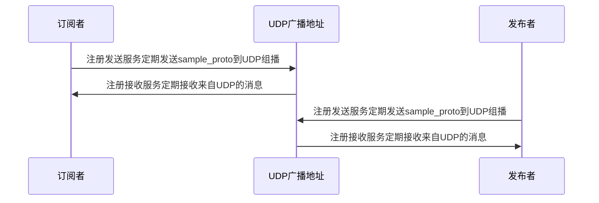
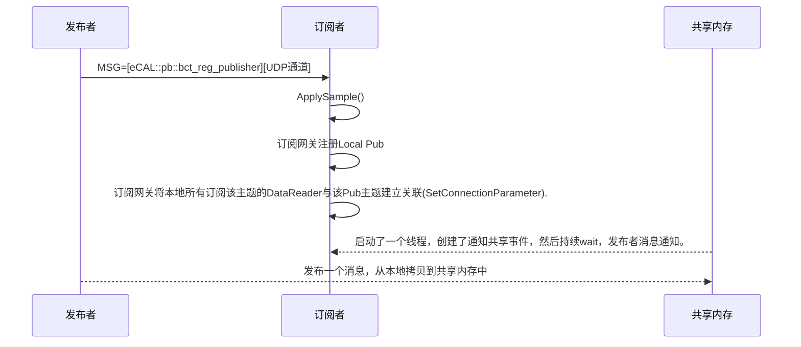

## shareMemory

### 1. 共享内存

需要解决的问题：

- 多个进程之间使用共享内存的最佳实践是什么？
- 如何合理设计锁对共享内存进行合理访问？
- 开源的共享内存通信库是怎么做的？
- 在ecal中如何共享内存进行消息传递的？

### 2. `Ecal`中有哪些部分需要共享内存

- 进程之间共享的`消息数据`需要使用共享内存。
- 控制访问消息数据的`锁`需要放置到共享内存中，以便多个进程先获取锁权限之后才可以访问消息数据。
- 消息投递完毕之后的通知信息，需要使用贡献内存维护发布订阅之间的消息。

### 2. ecal中共享内存的初始化操作
一般来说共享内存的操作主要是分为三个部分：  
- 1、创建共享内存
- 2、多个进程访问共享内存
- 3、使用完毕之后销毁共享内存

在`ecal`中，创建一个`pub`的时候，会创建一个`CDataWriter`内部对象，随之会创建`CDataWriterSHM`，而该对象内部维护了多个同步文件对象。在初始化的情况下，仅仅有一个初始同步文件对象。一个同步文件对象持有一个共享内存文件句柄类对象，以及一个事件处理哈希映射表。

```cpp
大致调流程如下：
pub -> CDataWriter->Create() -> SetUseShm() -> CDataWriterSHM->Create() -> std::make_shared<CSyncMemoryFile>  -> CSyncMemoryFile::Create() -> CMemoryFile::Create() -> memfile::db::AddFile(...SMemFileInfo) -> CNamedMutex->Create()
```




- `CDataWriter`对象：该对象与一个`PUB`对象对应，持有一组同步内存文件对象。


```cpp
class CDataWriterSHM
{
    //写入的index
    size_t m_write_idx;
    //共享同步文件动态数组
    std::vector<std::shared_ptr<CSyncMemoryFile>> m_memory_file_vec;
};
```

- 同步内存文件接口类

```cpp
//synchronized memory file interface
class CSyncMemoryFile
{
    
    std::string         m_base_name;			//基础名字。比如消息名，person
    std::string         m_memfile_name;			//共享内存文件名 person_时间戳_shm
    CMemoryFile         m_memfile;				//共享内存处理文件handler
    SSyncMemoryFileAttr m_attr;					//同步内存文件属性，限制了共享文件内存的最小值，打开延迟和响应延迟
    bool                m_created;				//是否已经创建
    struct SEventHandlePair
    {
      EventHandleT event_snd;
      EventHandleT event_ack;
    };
    //进程id与处理pair组成的map
    typedef std::unordered_map<std::string, SEventHandlePair> EventHandleMapT;
    std::mutex       m_event_handle_map_sync;   //事件处理互斥锁
    EventHandleMapT  m_event_handle_map;		//事件处理map
};

struct SEventHandle
{
    std::string name;			//名字
    void* handle;				//封装了一个在共享内存中的同步数据结构
};
//从上面可以看出主要有两个事件，第一个是snd，第二个是ack
//处理的名字拼接为：
    std::string event_snd_name = m_memfile_name + "_" + process_id_;
    std::string event_ack_name = m_memfile_name + "_" + process_id_ + "_ack";

	
//同步文件属性设置值，可以在ecal.ini中配置。
// set attributes
m_memory_file_attr.min_size        = Config::GetMemfileMinsizeBytes();
m_memory_file_attr.reserve         = Config::GetMemfileOverprovisioningPercentage();
m_memory_file_attr.timeout_open_ms = PUB_MEMFILE_OPEN_TO;
m_memory_file_attr.timeout_ack_ms  = Config::GetMemfileAckTimeoutMs();
```

- 共享内存文件句柄类（Shared memory file handler class）

```cpp
class CMemoryFile
{
    
    bool            m_created;				//是否创建
    bool            m_auto_sanitizing;		//自动检测
    access_state    m_access_state;			//获取状态，关闭，读，写
    std::string     m_name;					//共享内存文件名字, msgName_time_shm
    SInternalHeader m_header;				//内部头,保存了共享内存中的数据量情况
    SMemFileInfo    m_memfile_info;			//内存文件信息,里面保存了指向共享内存地址指针
    CNamedMutex     m_memfile_mutex;		//命名互斥锁
};

//共享文件信息
struct SMemFileInfo
{
    int          refcnt;				//引用计数
    bool         remove;
    MemFileT     memfile;				//文件描述符	shm_open打开文件返回值的整型值
    MapRegionT   map_region;			//该字段似乎只在win上有效，Linux上无效
    void*        mem_address;			//共享内存的地址空间
    std::string  name;
    size_t       size;
    bool         exists;
};

struct SMemFileHeader
{ //-V802
    uint16_t   hdr_size   = sizeof(SMemFileHeader);
    uint64_t   data_size  = 0;		
    uint64_t   id         = 0;
    uint64_t   clock      = 0;
    int64_t    time       = 0;
    uint64_t   hash       = 0;
    // ----- > 5.8 -----
    struct optflags
    {
      unsigned char zero_copy : 1; // allow reader to access memory without copying
      unsigned char unused    : 7;
    };
    optflags   options = { 0, 0 };
    // ----- > 5.11 ----
    int64_t    ack_timout_ms = 0;
};

//共享内存信息数据
struct SInternalHeader
{
    std::uint16_t int_hdr_size = sizeof(SInternalHeader);
    std::array<std::uint8_t, 6> _reserved_0   = {};
    std::uint64_t               cur_data_size = 0;			//当前数据量
    std::uint64_t               max_data_size = 0;			//最大数据量
};
```

- 命名互斥锁

```cpp
//抽象基类的pImp设计
class CNameMutexImplBase;
class CNameMutex
{
    std::unique_ptr<CNameMutexImplBase> m_impl;
};
//在Linux平台下：
 class CNamedMutexImpl : public CNamedMutexImplBase
 {
   private:
    named_mutex_t* m_mutex_handle;  //在Linux上实际就是named_mutex，
    std::string m_named;		    //注意，这个不是互斥锁的名字，而是共享内存的名字
    bool m_has_ownership;			//当创建初始化完毕之后，设置true
 };
```

- 命名事件处理处理句柄

在使用共享内存进行信息传递的时候，在pubgate注册某一个sub的时候，会与该进程创建一个连接的概念。这个连接的概念使得pub发送消息的时候，会通知对应的多个sub。这个连接的概念是使用命名事件结构体来耦合的。

本质上，`CNamedEvent`是一个拥有共享内存资源的结构体。而共享内存资源使用名字来唯一识别。

```cpp
class CNameEvent
{
    std::string m_name;
    named_event_t* m_event;  //指向共享内存的指针
};

struct alignas(8) named_event
{
    pthread_mutex_t mtx;
    pthread_cond_t cvar;
    uint8_t		    set;
};

```

在共享内存进行传输的时候，当pub发布一个数据的时候，sub是如何感知的。sub是如何接收数据的？

- pub在写入数据之后触发的操作?

### 各种共享内存文件的命名问题

1、m_topic_id是创建pub时候的时间戳。

2、注册超时时间为60000ms

#### 4、订阅端如何阻塞等待共享内存上消息的到来



这里存在的问题是如何保证订阅者打开的通知事件共享内存和发布者的是一致的。

- 消息共享内存和锁共享内存初始化

在发布者`CDataWriter`初始化的过程中，`主题名`以及`时间戳`都已经确定了。因此针对该主题消息的共享内存和保持该主题消息同步的共享内存都已经可以的创建了，分别为如下。接下来当检测到订阅者的时候只需要将这些信息告知订阅者即可。

```bash
消息名_时间戳_shm
消息名_时间戳_shm_mtx
```

- 发布者如何将共享内存消息通知订阅者？


