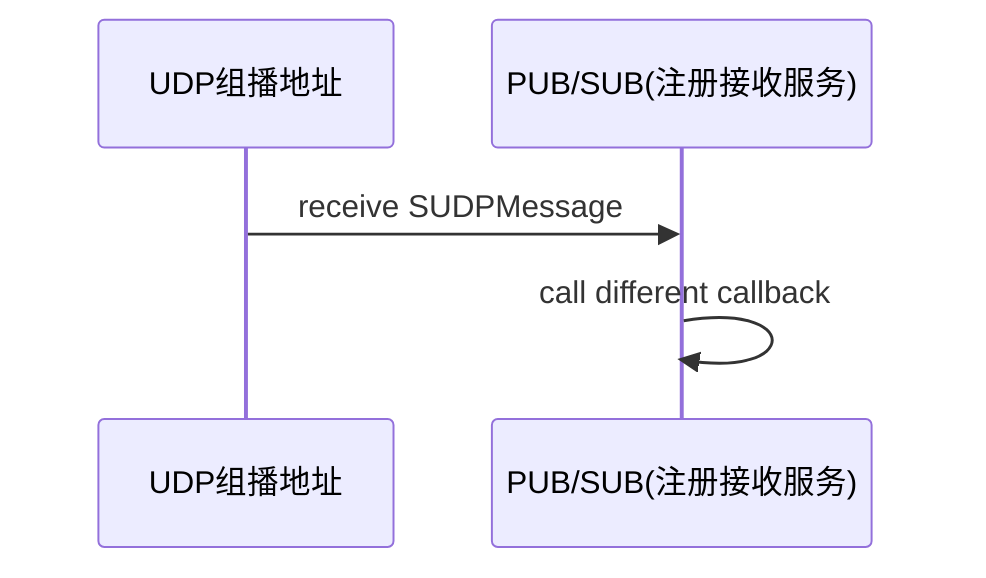

## 注册接收服务

### 1、概述

该模块的主要功能在启动的`Ecal`节点上起一个线程，该线程的功能是：从指定UDP端口/共享内存读取协议消息，然后根据协议消息内容，执行不同的注册操作。



 `SUDPMessage`的具体协议如下：主要是一个协议头部和负载两个部分。主要有四种信息类型，未知，信息头，信息体，带信息头的信息体。

```cpp
struct SUDPMessage
{
  struct SUDPMessageHead header;					//信息头
  char                   payload[MSG_PAYLOAD_SIZE];	//实际消息内容
};
struct alignas(4) SUDPMessageHead		//信息头
{
  char     head[4];   //-V112
  int32_t  version;
  int32_t  type;	  //信息类型
  int32_t  id;        // unique id for all message parts
  int32_t  num;       // header: number of all parts,      data: current number of that part
  int32_t  len;       // header: complete size of message, data: current size of that part
};

enum eUDPMessageType
{
  msg_type_unknown             = 0,
  msg_type_header              = 1,
  msg_type_content             = 2,
  msg_type_header_with_content = 3
};
```

- 持续接收线程执行函数如下：`CSampleReceiver::Receive`，负责从`UDP`接收信息。

```cpp
int CSampleReceiver::Receive(eCAL::CUDPReceiver* sample_receiver_)
{
  if(!sample_receiver_) return(-1);

  // wait for any incoming message
  size_t recv_len = sample_receiver_->Receive(m_msg_buffer.data(), m_msg_buffer.size(), 10);
  if(recv_len > 0)
  {
    return(Process(m_msg_buffer.data(), recv_len));
  }

  return(0);
}
```

Receive函数实际调用为`CUDPReceiverAsio::Receive`，最终使用的是`ASIO库`的异步调用接口。

```cpp
  size_t CUDPReceiverAsio::Receive(char* buf_, size_t len_, int timeout_, ::sockaddr_in* address_ /* = nullptr */)
  {
      m_socket.async_receive_from(asio::buffer(buf_, len_), m_sender_endpoint,
      [&reclen](std::error_code ec, std::size_t length)
      {
        if (!ec)
        {
          reclen = length;
        }
      });
  }
```

如果接收的数据大于0，则会调用执行函数。

```cpp
int CSampleReceiver::Process(const char* sample_buffer_, size_t sample_buffer_len_)
{
    1.将数据强转为SUDPMessage，然后处理。
    2.根据sample类型进行不同的处理。、
    3.如果是带有头部信息的消息，随着将它转换为protobuf的Sample处理。
    4. 调用CUdpRegistrationReceiver::ApplySample()处理具体的pb协议。
}
```

下面是`Sample`的定义，`Sample`消息有不同的指令，表示该消息不同的用途。

```protobuf
message Sample                                 // a sample is a topic
{
  eCmdType     cmd_type              =  1;     // sample command type
  Host         host                  =  2;     // host information
  Process      process               =  3;     // process information
  Service      service               =  4;     // service information
  Client       client                =  7;     // client information
  Topic        topic                 =  5;     // topic information
  Content      content               =  6;     // topic content
}

enum eCmdType                                  // command type
{
  bct_none           = 0;                      // undefined command
  bct_set_sample     = 1;                      // set sample content
  bct_reg_publisher  = 2;                      // register publisher
  bct_reg_subscriber = 3;                      // register subscriber
  bct_reg_process    = 4;                      // register process
  bct_reg_service    = 5;                      // register service
  bct_reg_client     = 6;                      // register client
}
```

### 2、收到发布者注册服务流程

```cpp
g_registration_receiver()->ApplySample(ecal_sample_);
CRegistrationReceiver::ApplySample(...)
{
    switch(ecal_sample_.cmd_type())
    {
      case eCAL::pb::bct_reg_publisher:
      {
        if(IsLocalHost(ecal_sample_))		//查看是不是本机
        {
          // do not register publisher of the same process
          // only if loop back flag is set true
          if(m_loopback || (ecal_sample_.topic().pid() != Process::GetProcessID()))
          {
            if (g_subgate()) g_subgate()->ApplyLocPubRegistration(ecal_sample_);
          }
        }
        else
        {
          if(m_network)
          {
            if (g_subgate()) g_subgate()->ApplyExtPubRegistration(ecal_sample_);
          }
        }
        if (m_callback_pub) m_callback_pub(reg_sample.c_str(), static_cast<int>(reg_sample.size()));
      }
    }
}
```


